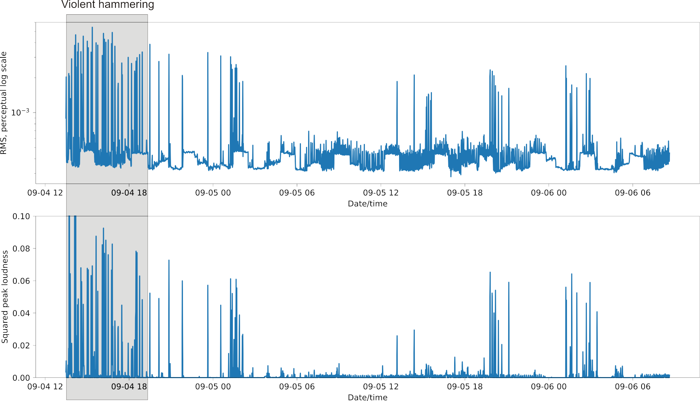

# Android Sound Logger

Turns an Android phone into a remote (uncalibrated) sound level meter
writing RMS and max amplitude every minute to firebase.

Plots the results using the python firebase API and matplotlib.

These are chunks of 1min audio, A-weighted. Then
the RMS and max amplitude was calculated on the
phone and transmitted to google's firebase.

Note that mobile phones are not good at recording absolute sound
levels but very good at recording *sudden changes* in sound levels.
Since mobile phones have automatic gain control (AGC) plotting in dB
is not possible as they don't deliver absolute readings but
*relative* ones.
